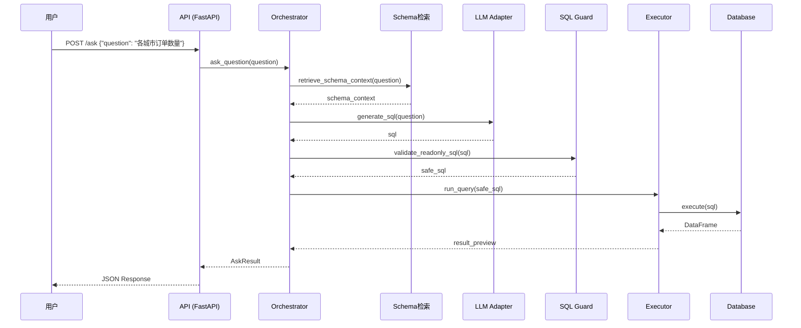
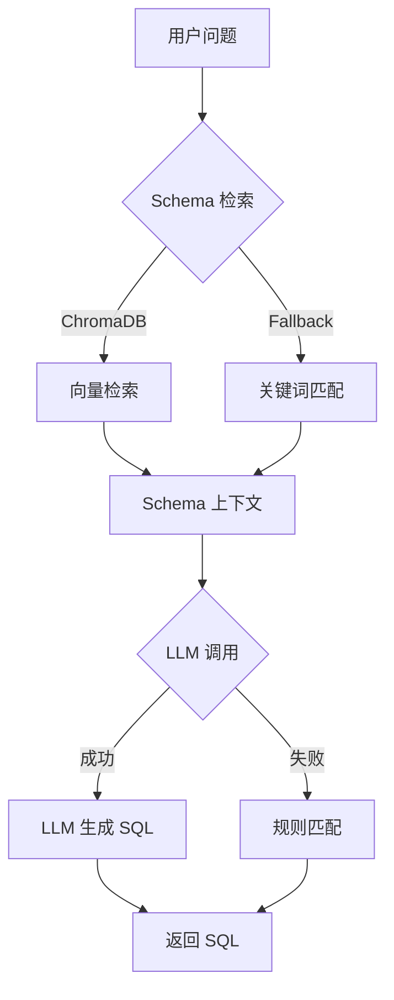
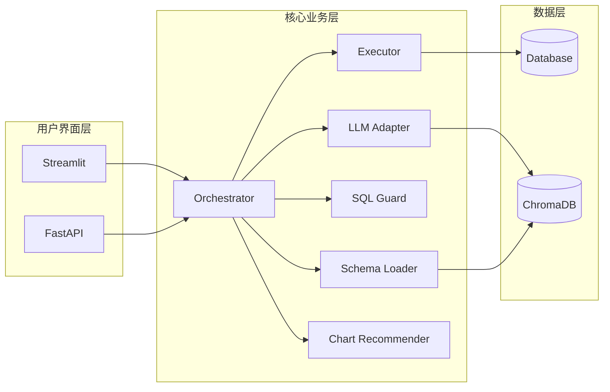

# 架构说明

> Text2SQL Agent 系统架构详解

## 目录

- [系统架构概览](#系统架构概览)
- [模块详解](#模块详解)
- [数据流](#数据流)
- [核心流程](#核心流程)
- [扩展点](#扩展点)
- [设计决策](#设计决策)

---

## 系统架构概览

### 四层架构

```
┌─────────────────────────────────────────────────────────────────┐
│                         用户界面层                               │
│   ┌─────────────────┐        ┌──────────────────────────┐      │
│   │  Streamlit UI   │        │    FastAPI REST API      │      │
│   │  (Port 8501)    │        │      (Port 8000)         │      │
│   │                 │        │                          │      │
│   │ - 问题输入      │        │ - POST /ask              │      │
│   │ - 结果展示      │        │ - GET /health            │      │
│   │ - 图表渲染      │        │ - GET /schemas           │      │
│   │ - 导出功能      │        │ - OpenAPI Docs           │      │
│   └────────┬────────┘        └─────────────┬────────────┘      │
└────────────┼───────────────────────────────┼───────────────────┘
             │                               │
             └───────────────┬───────────────┘
                             │
┌────────────────────────────▼────────────────────────────────────┐
│                         编排层 (Orchestrator)                    │
│   ┌─────────────────────────────────────────────────────────┐   │
│   │                     Pipeline                             │   │
│   │                                                         │   │
│   │   Question → 本地分类 → 本地规则/模板 → 复杂问题再LLM   │   │
│   │            → 安全校验 → 执行                            │   │
│   │                                                         │   │
│   │   源码: app/core/orchestrator/pipeline.py               │   │
│   └─────────────────────────────────────────────────────────┘   │
└────────────────────────────┬────────────────────────────────────┘
                             │
┌────────────────────────────▼────────────────────────────────────┐
│                         核心业务层                               │
│                                                                 │
│   ┌───────────────┐  ┌───────────────┐  ┌───────────────────┐  │
│   │  LLM Adapter  │  │ SQL Executor  │  │  Chart Recommender│  │
│   │               │  │               │  │                   │  │
│   │ - 本地分类    │  │ - SQLite      │  │ - 类型分析        │  │
│   │ - 规则/模板   │  │ - MySQL       │  │ - 图表推荐        │  │
│   │ - LLM补充理解 │  │ - PostgreSQL  │  │ - 置信度计算      │  │
│   │ - Fast Fallback│ │               │  │                   │  │
│   └───────────────┘  └───────────────┘  └───────────────────┘  │
│                                                                 │
│   ┌───────────────┐  ┌───────────────┐  ┌───────────────────┐  │
│   │  SQL Guard    │  │ Schema Loader │  │   SQL Explainer   │  │
│   │               │  │               │  │                   │  │
│   │ - 注入防护    │  │ - ChromaDB    │  │ - SQL→自然语言    │  │
│   │ - 表白名单    │  │ - 向量检索    │  │                   │  │
│   │ - LIMIT强制   │  │ - 关键词匹配  │  │                   │  │
│   └───────────────┘  └───────────────┘  └───────────────────┘  │
└────────────────────────────┬────────────────────────────────────┘
                             │
┌────────────────────────────▼────────────────────────────────────┐
│                         数据层                                   │
│   ┌───────────────┐  ┌───────────────┐  ┌───────────────────┐  │
│   │   SQLite      │  │    MySQL      │  │   PostgreSQL      │  │
│   │   (Demo)      │  │ (Production)  │  │  (Production)     │  │
│   └───────────────┘  └───────────────┘  └───────────────────┘  │
│                                                                 │
│   ┌─────────────────────────────────────────────────────────┐   │
│   │                    ChromaDB                              │   │
│   │                 (向量数据库)                             │   │
│   │   - Schema DDL 存储                                      │   │
│   │   - 示例 SQL 存储                                        │   │
│   │   - 语义检索支持                                         │   │
│   └─────────────────────────────────────────────────────────┘   │
└─────────────────────────────────────────────────────────────────┘
```

### 目录结构

```
text2sql-agent/
├── app/
│   ├── api/                    # FastAPI 路由
│   │   ├── main.py            # 应用入口
│   │   └── routes/            # 路由模块
│   │
│   ├── ui/                     # Streamlit 界面
│   │   ├── streamlit_app.py   # 主界面
│   │   ├── chart_renderer.py  # 图表渲染
│   │   └── exporter.py        # 导出功能
│   │
│   ├── core/                   # 核心业务逻辑
│   │   ├── nlu/               # 本地问题分类
│   │   │   └── question_classifier.py
│   │   │
│   │   ├── llm/               # LLM 补充能力
│   │   │   ├── adapters.py    # Provider 适配器
│   │   │   ├── client.py      # 客户端封装
│   │   │   └── prompts.py     # Prompt 模板
│   │   │
│   │   ├── sql/               # SQL 模块
│   │   │   ├── generator.py   # SQL 生成
│   │   │   ├── executor.py    # SQL 执行
│   │   │   ├── guard.py       # 安全校验
│   │   │   ├── database.py    # 数据库抽象层
│   │   │   └── connectors/    # 数据库连接器
│   │   │
│   │   ├── retrieval/         # 检索模块
│   │   │   └── schema_loader.py  # Schema 加载
│   │   │
│   │   ├── chart/             # 图表模块
│   │   │   ├── recommender.py # 图表推荐
│   │   │   └── type_analyzer.py  # 类型分析
│   │   │
│   │   └── orchestrator/      # 编排层
│   │       └── pipeline.py    # 主流程
│   │
│   ├── config/                # 配置
│   │   └── settings.py        # 配置管理
│   │
│   └── shared/                # 共享模块
│       └── schemas.py         # Pydantic 模型
│
├── data/
│   ├── demo_db/               # Demo 数据库
│   ├── ddl/                   # DDL 文件
│   └── chroma/                # ChromaDB 数据
│
├── scripts/                   # 工具脚本
├── tests/                     # 测试用例
└── docs/                      # 文档
```

---

## 模块详解

### 1. 本地优先语义层 + LLM 补充层

**位置**：`app/core/nlu/`、`app/core/retrieval/`、`app/core/sql/`、`app/core/llm/`

**职责**：
- 先做本地问题分类
- 用本地 schema context、字段别名、时间短语补上下文
- 优先命中规则 SQL / 模板 SQL / fast-fallback
- 仅复杂问题再尝试 LLM

**当前主链路**：

```
Question
  ↓
QuestionClassifier
  ↓
SchemaLoader / LocalSemantics
  ↓
Rule SQL / Template SQL / Fast Fallback
  ↓
(only if needed) LLM Adapter
  ↓
SQL Guard
  ↓
Executor
```

**本地优先的原因**：
- 测试环境默认不能依赖有效 API Key
- 简单问题本地规则更快、更稳、可解释
- LLM 留给复杂自然语言理解，减少主链路超时

**运行模式说明**：
- `fallback`：本地规则 / 模板 / fast-fallback 已完成处理
- `llm`：复杂问题由 LLM 补充理解后生成 SQL
- 推荐默认把 `fallback` 视为主成功路径，而不是降级失败路径

---

### 2. Schema 检索模块

**位置**：`app/core/retrieval/`

**职责**：从 ChromaDB 检索相关 Schema 信息，为 LLM 提供上下文。

**核心函数**（源码：`schema_loader.py`）：

```python
def retrieve_schema_context(question: str, limit: int = 4) -> str:
    """检索相关的 Schema 上下文
    
    优先级：
    1. ChromaDB 向量检索
    2. 关键词匹配（fallback）
    3. DDL 全量（兜底）
    """
    settings = get_settings()
    client = chromadb.PersistentClient(path=str(Path(settings.vector_db_path) / "schema_store"))
    
    try:
        collection = client.get_collection("schema_docs")
        # 向量检索
        result = collection.query(query_texts=[question], n_results=limit)
        documents = result.get("documents", [[]])[0]
        if documents:
            return "\n\n".join(documents)
    except Exception:
        pass
    
    # Fallback: 关键词匹配
    return _keyword_fallback(question)
```

---

### 3. SQL 模块

**位置**：`app/core/sql/`

**组件**：

| 文件 | 职责 |
|------|------|
| `generator.py` | SQL 生成（规则匹配） |
| `executor.py` | SQL 执行 |
| `guard.py` | 安全校验 |
| `database.py` | 数据库抽象层 |
| `connectors/` | 各数据库连接器 |

**安全校验**（源码：`guard.py`）：

```python
class SQLValidator:
    """SQL 安全校验器"""
    
    FORBIDDEN_KEYWORDS = {
        "insert", "update", "delete", "drop", "alter", "truncate",
        "create", "replace", "attach", "pragma", "vacuum",
    }
    
    def validate(self, sql: str) -> SQLValidationResult:
        # 1. 多语句检查
        # 2. 只读模式检查
        # 3. 危险关键字检查
        # 4. 表白名单检查
        # 5. 添加 LIMIT
        ...
```

---

### 4. 图表推荐模块

**位置**：`app/core/chart/`

**推荐规则**（源码：`recommender.py`）：

| 数据特征 | 推荐图表 | 置信度 |
|---------|---------|--------|
| 时间 + 数值 | 折线图 | 0.85 |
| 分类 + 数值（低基数） | 柱状图 | 0.80 |
| 单分类（<10 类） | 饼图 | 0.75 |
| 双数值 | 散点图 | 0.70 |

---

### 5. 编排层

**位置**：`app/core/orchestrator/pipeline.py`

**职责**：组装各模块，完成端到端流程。

```python
def ask_question(question: str) -> AskResult:
    """主流程入口"""
    # SQL 生成（包含 Schema 检索 + 安全校验）
    sql, explanation, mode, blocked_reason = generate_sql(question)
    
    # 执行查询
    df = run_query(sql)
    
    return AskResult(...)
```

---

## 数据流

### 完整请求流程

```
POST /ask {"question": "各城市订单数量"}
    │
    ▼
Step 1: 参数校验 (main.py → AskRequest)
    │
    ▼
Step 2: 问题分类 (question_classifier.py)
    │   simple_lookup / ranked_aggregation / complex_analysis / unknown
    │
    ▼
Step 3: 本地上下文构造 (schema_loader.py + local_semantics.py)
    │   Schema、字段别名、时间短语、实体信息
    │
    ▼
Step 4: SQL 生成 (generator.py / client.py)
    │   ├── 简单/半复杂问题：规则 SQL / 模板 SQL / fast-fallback
    │   └── 复杂问题：再尝试 LLM
    │
    ▼
Step 5: 安全校验 (guard.py → validate_readonly_sql)
    │   检查: 仅允许 SELECT、表白名单、危险关键字
    │
    ▼
Step 6: 执行查询 (executor.py → run_query)
    │   连接数据库 → 执行 SQL → 返回 DataFrame
    │
    ▼
Step 7: 图表推荐 (chart/recommender.py → recommend)
    │   分析数据类型 → 推荐图表 → 计算置信度
    │
    ▼
Step 8: 构建响应 (schemas.py → create_ask_response)
    │
    ▼
返回 JSON 响应
```
---

## 扩展点

### 1. 新增 LLM Provider

```python
# 1. 在 adapters.py 创建适配器
@dataclass(frozen=True)
class MyLLMAdapter:
    provider_name: str = "my_llm"
    
    def generate_sql(self, question: str) -> str:
        ...

# 2. 在 settings.py 添加配置
# 3. 在 client.py 注册 Provider
```

### 2. 新增数据库类型

```python
# 1. 在 connectors/ 创建连接器
class ClickHouseConnector(DatabaseConnector):
    def _create_engine(self) -> Engine:
        ...

# 2. 在 database.py 注册
```

### 3. 新增图表类型

```python
# 1. 在 recommender.py 添加推荐逻辑
# 2. 在 chart_renderer.py 添加渲染函数
```

---

## 设计决策

### 1. 为什么采用“本地优先 + LLM 补充”路线？

| 方案 | 优点 | 缺点 |
|------|------|------|
| **本地优先 + LLM 补充** | 简单问题更快、更稳、可解释；测试阶段不强依赖有效 API Key | 需要持续维护规则、模板与本地语义映射 |
| 直接 LLM 主路径 | 灵活、对开放式问题覆盖更广 | 易受 API、网络、时延与成本影响 |
| 纯规则系统 | 确定性强 | 对复杂自然语言理解能力有限 |

### 2. 为什么使用双层 Fallback？

```
LLM → 规则匹配 → 默认 SQL
```

**原因**：
- LLM 可能失败（API 限流、网络问题）
- 规则匹配提供确定性保障
- 默认 SQL 确保系统永不崩溃

---

## 流程图（Mermaid）

### 请求处理时序图



### SQL 生成流程图



### 模块依赖图



---

## 更新记录

| 日期 | 更新内容 |
|------|----------|
| 2026-03-22 | 新增 Mermaid 流程图 |
| 2026-03-22 | 细化架构文档 |
| 2026-03-20 | 创建架构文档初版 |